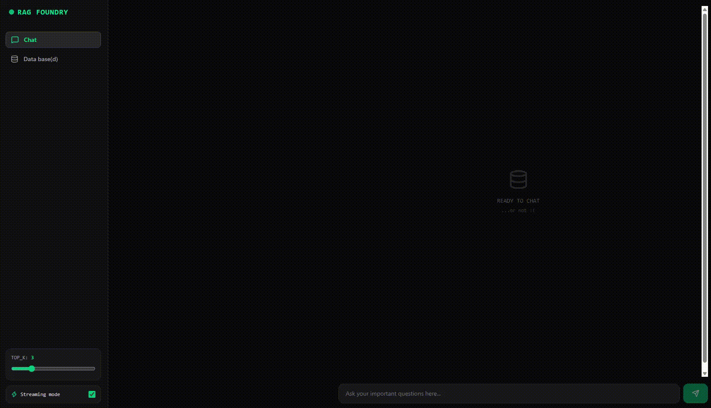

# RAG Foundry

A RAG microservice blueprint presented by @Probirochniy.

Stack: **FastAPI**, **LangGraph**, **Qdrant**, **TEI**, and **Redis**.

## Optimistic Streaming idea POC

Traditional safe RAG is suboptimal:
`Retrieve -> Generate -> Critic Judge LLM Evaluates -> Staring at a dead loading spinner all that time -> "ARGHH where is my answer!!" -> User closes the tab. :(`

Here, I tried to implement Optimistic Streaming to save the dopamine-addicted brains:

1. **Instant Token Spew**: stream tokens to the frontend via SSE the millisecond they are generated. Near-zero TTFT.
2. **Background Fact-Checking**: LangGraph runs the critic agent behind the scenes.
3. **Schizo Caught**: If the critic detects hallucinated hallucination slop not backed by your vector context, it emits an `event: reset`.
4. **Cope & Retry**: The UI wipes the hallucinated garbage on the fly, injects a warning prompt into the context, and re-generates the answer. If the fallback also fails, we fail-open: seethe, cry, but cope.

## How it works

Like this:

<p align="center">
  
</p>


## Features

- **LangGraph Anti-Hallucination Loop**: Self-correcting state graph that bullies the model into answering strictly based on retrieved chunks.
- **Local TEI Inference**: Self-hosted HuggingFace Text Embeddings Inference running `bge-small-en-v1.5`.
- **Qdrant Vector Storage**: Async cosine-similarity search with deterministic UUID5 chunk indexing.
- **Redis Token Saver**: Queries are hashed and cached in Redis so you don't pay for API twice. Stonks.
- **Langfuse Observability Stack**: Pre-configured ClickHouse + Postgres + MinIO profile for obsessively inspecting token costs and latency traces.
- **Vite + React 19 + Tailwind v4 UI**: Fast, responsive interface with chat, ingest form, `TOP_K` slider and non-streaming option if you need it for some reason.
- **K8s + ArgoCD**: Full GitOps manifests included. Just for flex.

---


## 🛠️ Tech Stack

| Layer | Tech |
|---|---|
| **Backend** | Python 3.12, FastAPI, uv, Pydantic v2 |
| **Orchestration** | LangChain, LangGraph |
| **Observability** | LangFuse v3 |
| **Vector DB** | Qdrant |
| **Embeddings** | Hugging Face TEI / FastEmbed |
| **Cache** | Redis 7.4 Alpine |
| **Frontend** | React 19, Vite, Tailwind CSS v4, Lucide |
| **DevOps** | Docker Compose, K8s, Kustomize, ArgoCD, GitHub Actions |

---

## Ok how do I start it.

### 1. Clone & Set Up Env
```bash
git clone https://github.com/Probirochniy/rag-foundry.git
cd rag-foundry
cp .env.example .env
```

Fill in your `OPENAI_API_KEY` in .env if paying to OpenAI, or use local vLLM instance like a god. You can redefine the prompts too with adding `RAG_SYSTEM_PROMPT`!


### 2. Run with Docker Compose
Spin up the backend, frontend, Qdrant, Redis, and TEI:

```bash
docker compose -f docker-compose.dev.yml up --build -d
```

Frontend will be up at `http://localhost:3000`.

Backend Swagger docs at `http://localhost:8000/docs`.

**That's it, you are awesome.**

>💡 But I want full Langfuse tracing!!

God bless.
Uncomment `COMPOSE_PROFILES=langfuse` in your .env and enjoy.

Be ready that it starts postgres, s3, clickhouse, langfuse server and worker, which is clearly an overkill for this app. ~~I really should have stayed on v2...~~


## API Endpoints
- `POST /api/v1/rag/ingest` - Chunk text and upsert to Qdrant vector index.
- `POST /api/v1/rag/query` - Standard RAG query.
- `POST /api/v1/rag/stream` - SSE streaming endpoint.
- `GET /healthz` & `GET /readyz` - Kubernetes liveness and readiness probes checking the backing services.

## License

MIT. Do whatever you want with it idc.
